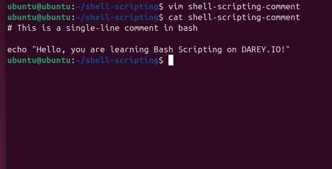
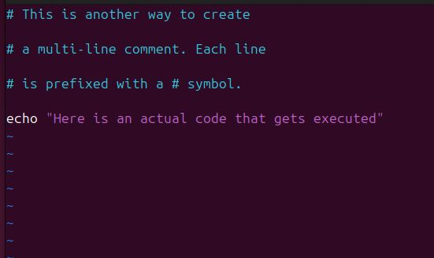

# Linux-Shell-Scripting-Comment

## Project Review

In Linux shell scripting, comments are essential for code readability, maintainability, and collaboration. A comment begins with a *#* symbol, and everything after it on the same line is ignored by the shell. 

## Single-line Comment

This is started by # in bash, and everything in that statement is treated as a comment and not executed as a code. For example;

'# This is a single-line comment in bash'

'echo "Hello, you are learning Bash Scripting on DAREY.IO!"'

## Multiple Single-line Comment

This is used to add multiple single-line comment with each statement starting with *#*. For example;

'# This is another way to create
'# a multi-line comment. Each line'
'# is prefixed with a # symbol.'
'echo "Here is an actual code that gets executed"'

